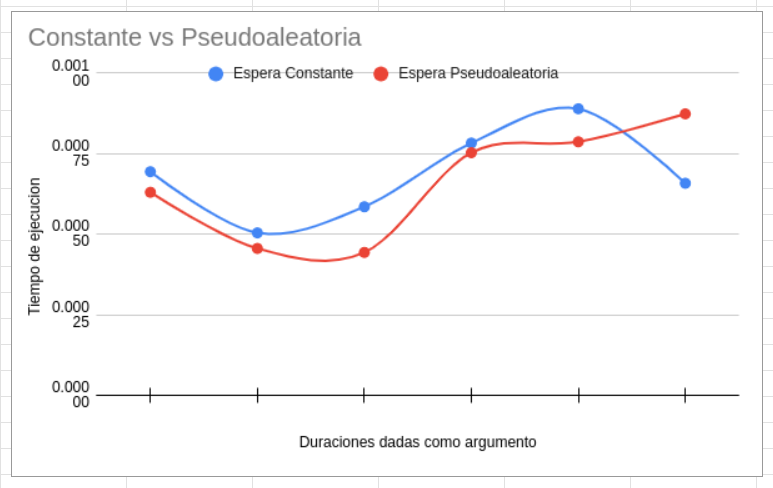

# delayed_busy_wait
Espera activa con retraso. ¿Se corrige el problema de la espera activa si en 
lugar de tener un ciclo vacío, se espera un cierto tiempo? Copie su carpeta 
ejemplos/pthreads/hello_order_busywait a ejercicios/pthreads/delayed_busy_wait. 
Permita que el usuario pueda invocar su programa dos argumentos de línea de 
comandos: la cantidad de hilos a crear, y la cantidad de microsegundos a esperar 
cuando no es el turno del hilo de ejecución.

Espera activa con retraso constante. Si no es el turno de un hilo, éste espera 
una cantidad constante de microsegundos, algo como:

// Constant delayed busy waiting: wait until it is my turn
while (next_thread < my_thread_id) {
  usleep(delay);
}
Recuerde probar la calidad de su código (sanitizers, linter). Luego ejecute al 
menos tres veces su solución (sin sanitizers) con la cantidad máxima de hilos 
e ejecución que su sistema operativo le permite crear y una espera de 50µs. 
Escriba en el readme.md del ejercicio la mayor de las duraciones que obtuvo de 
sus corridas. ¿Hubo una mejora de la espera constante respecto a la espera 
activa pura?

Espera activa con retraso pseudoaleatorio. Altere su solución al ejercicio 
para que en lugar de esperar exactamente la cantidad de microsegundos indicada 
por el usuario, espere por una cantidad pseudoaleatoria de microsegundos cuyo 
límite es el número indicado por el usuario en el segundo argumento de línea 
de comandos. Sugerencia: puede usar compilación condicional para implementar 
esta variación. La espera varía en cada iteración del ciclo de espera activa, 
algo como:

// Random delayed busy waiting: wait until it is my turn
while (next_thread < my_thread_id) {
	const unsigned my_delay = rand_r(&my_seed) % max_delay;
  usleep(my_delay);
}
Ejecute al menos tres veces su solución pseudoaleatoria con la cantidad máxima 
de hilos y un máximo de espera de 50µs. Tome la mayor de las duraciones. 
¿Hubo una mejora de la espera pseudoaleatoria respecto a la espera constante?

Comparación de las esperas. ¿Mejora el tiempo de ejecución de los dos tipos de 
esperas (constante y pseudoaleatoria) si disminuye o incrementa la espera 
máxima de los hilos? Haga al menos un par de ejecuciones con al menos los 
siguientes tiempos de espera:

1µs

5µs

25µs

50µs

75µs

100µs

Sugerencia: si hay varios compañeros(as) trabajando el mismo ejercicio en el 
laboratorio, escojan tiempos diferentes y compartan los resultados. Pueden 
crear una gráfica en un documento compartido. Agreguen más tiempos de ejecución 
si hay más de 6 integrantes.

Cree una gráfica donde el eje-x son las duraciones dadas por argumento al 
programa. El eje-y son los tiempos de ejecución de los programas. El gráfico 
tendrá dos series, una para la espera constante y otra para la espera
pseudoaleatoria.

Agregue la gráfica al readme.md del ejercicio y una discusión de a lo sumo 
dos párrafos. Indique cuál fue el mejor tiempo máximo de espera obtenido y 
los efectos de disminuir o incrementarlo. Conjeture y trate de explicar por 
qué ocurre este comportamiento. Finalmente indique si la espera activa con 
retraso es una solución óptima, y en caso negativo, provea una idea que pueda 
lograr este ideal.

## Respuestas

### Espera activa con retraso constante
Mayor duracion: 0.000634407s
Si hubo una mejora, con la espera activa normal el tiempo promedio esta 
en 002197045s, por lo que el retraso constante acelera la ejecucion

### Espera activa con retraso pseudoaleatorio
Mayor duracion: 0.000513339s
Si hubo una mejora, con la espera activa constante

### Comparación de las esperas
1µs (2 hilos) -> 0.000320661s (espera constante), 0.000202156s (espera pseudoaleatoria)
1µs (8 hilos) -> 0.000694169s (espera constante), 0.000630191s (espera pseudoaleatoria)

5µs (2 hilos) -> 0.000151259s (espera constante), 0.000135874s (espera pseudoaleatoria)
5µs (8 hilos) -> 0.000504343s (espera constante), 0.000455926s (espera pseudoaleatoria)

25µs (2 hilos) -> 0.000150557s (espera constante), 0.000155796s (espera pseudoaleatoria)
25µs (8 hilos) -> 0.000585421s (espera constante), 0.000443479s (espera pseudoaleatoria)

50µs (2 hilos) -> 0.000173037s (espera constante), 0.000151385s (espera pseudoaleatoria)
50µs (8 hilos) -> 0.000783117s (espera constante), 0.000753153s (espera pseudoaleatoria)

75µs (2 hilos) -> 0.000221970s (espera constante), 0.000120366s (espera pseudoaleatoria)
75µs (8 hilos) -> 0.000889472s (espera constante), 0.000787028s (espera pseudoaleatoria)

100µs (2 hilos) -> 0.000210182s (espera constante), 0.000443669s (espera pseudoaleatoria)
100µs (8 hilos) -> 0.000658341s (espera constante), 0.000873679s (espera pseudoaleatoria)

Conclusion: No parece haber un patron en base a la espera maximo tanto en
espera constante como pseudoaleatoria. 

### Grafica

https://docs.google.com/spreadsheets/d/1knNd3_cSk2_2Fly7p3KVAaiPHVaxVNfaKAYDpew2HAc/edit?usp=sharing

El mejor tiempo de espera para todas las pruebas fue 0.000443479s, en la espera
pseudoaleatoria de 8 hilos y 25 milisegundos. El peor tiempo de espera fue de
0.000889472s, en la espera constante de 8 hilos y 75 milisegundos.

La espera de 5 y 25 milisegundos generaron los tiempos de ejecucion mas bajos,
tanto para la espera constante como para la activa. Esto incluso mas bajo que
la espera de 1 milisegundo. 

La espera constante fue mas tardada para todos los milisegundos excepto los
100 milisegundos.

De esto interpreto que es logico que a mayor los milisegundos, probablemente
el caso pseudoaleatorio gane. Esto porque la espera constante siempre
va a esperar los milisegundos dados, en cambio el pseudoaleatorio puede dar
numeros menores. A menor los milisegundos, menor el rango de discrepancia, por
lo que el comportamiento en espera constante y espera activa es mas similar en
milisegundos bajos que en altos

La espera activa con retraso no me parece una solucion optima, no soluciona
las condiciones de carrera e incrementa el determinismo. Ademas que desperdicia
recursos

