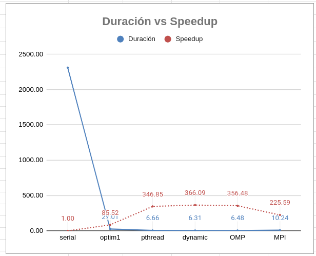
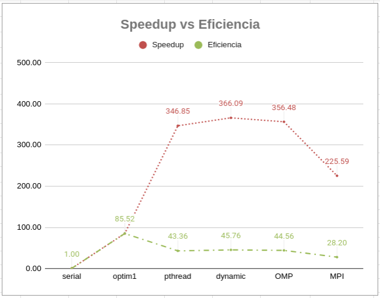

# Documento de Reporte

En este documento se analizará el desempeño de las tecnologías omp y mpi en el contexto de esta tarea.

Se puede encontrar el Google Sheets con las mediciones y gráficos en el
siguiente link:
<https://docs.google.com/spreadsheets/d/1IaVuXf8_Lzvyyenxolq1bMZdYbxvOmKjDDDtBDgQb7k/edit?usp=sharing>

## Gráficos

## OMP vs Pthread

Para determinar el desempeño de la tecnología OMP vs Pthread, se comparó el tiempo de ejecución de OMP con la versión serial, tal y como se hizo con Pthread. Se calcula la nueva duración (6.48), el speedup (356.48) y la eficiencia (44.56).

Ahora, este speedup y eficiencia es lo que se usa para comparar con Pthread. Al ver los gráficos, se puede apreciar que OMP tiene un rendimiento prácticamente igual que la versión Pthread.

Tanto en duración, speedup y eficiencia los valores están muy parecidos, y la diferencia es prácticamente despreciable.

En mi opinión, OMP resulta siendo una tecnología muho mejor que Pthread, porque permite hacer lo mismo, con un código mucho más legible y escalable.  

## MPI vs OMP

La comparación MPI vs OMP tiene el mismo concepto, se compara la versión MPI on la misma que se comparó OMP, y con la duración (10.24), speedup (225.59) y eficiencia (28.20) obtenidos, se comparan entre sí.

Al hacer los cálculos, podemos ver que la diferencia ahora sí es más considerable. Siendo más lento, con menos speedup y menos eficiencia.

Sin embargo, a diferencia de OMP vs Pthread, esto no me parece una desventaja total. Para el contexto de esta tarea es cierto que puede resultar innecesario, y la creación de los procesos retarda MPI. Pero en otros contextos, la tenología MPI puede optimizar considerablemente procesos, debido a que se puede distribuir el trabajo con más granularidad, y para trabajos muy pesados, puede terminar siendo más rápido que solo OMP.
