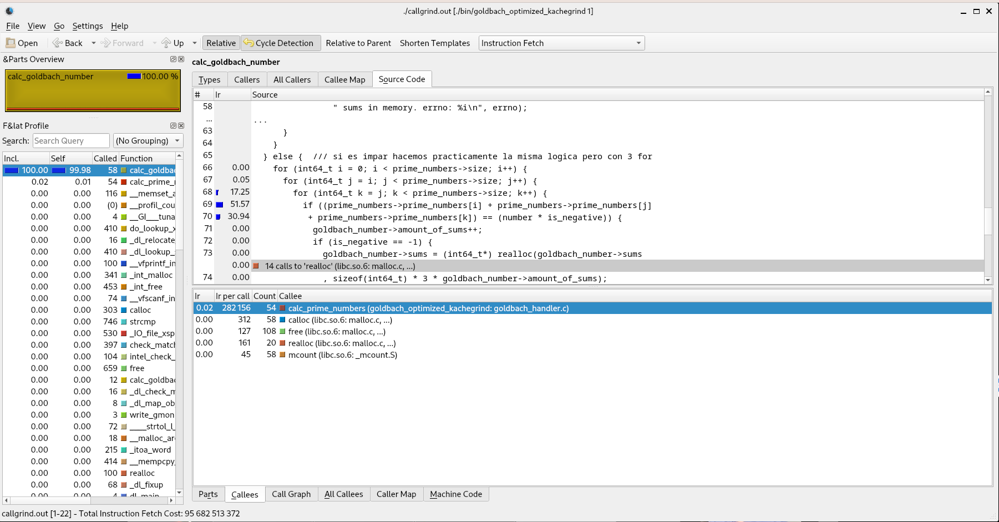
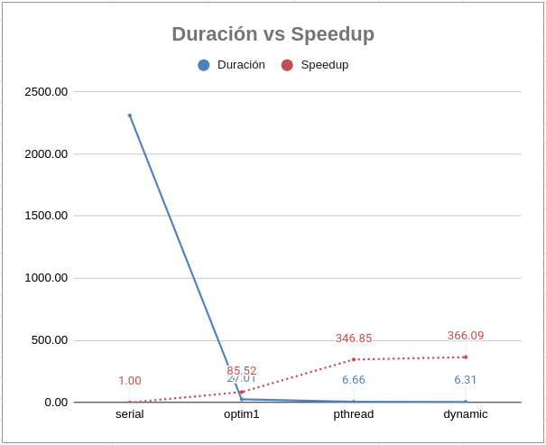
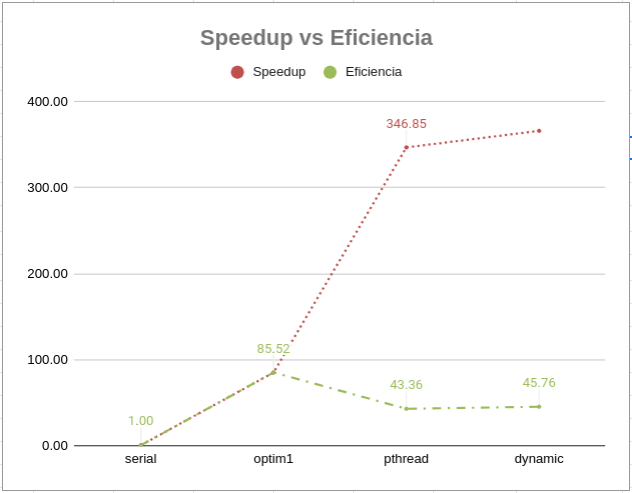

# Documento de Reporte

Cabe aclarar que cada número estudiado de la optmizacion, `Duración`, `Speedup`
y `Eficiencia`, van a ser calculados en base a los datos de la version
serial no optmizada.

Se puede encontrar el Google Sheets con las mediciones y gráficos en el
siguiente link:
<https://docs.google.com/spreadsheets/d/1IaVuXf8_Lzvyyenxolq1bMZdYbxvOmKjDDDtBDgQb7k/edit?usp=sharing>

## Optimización 1: Serial

### Paso 1 (Serial)

`Duración` antes de cualquier optimización: 2310.00s = 38.5min

### Paso 2 (Serial)

Al ver la imagen de kcachegrind,   
se puede apreciar que el 99 por ciento de la CPU es consumida por la función  
calc_goldbach_numbers. Al ver el código fuente podemos observar que el triple
for de la calculación para números impares consume él solo el 99.74% de ese  
llamado en las líneas 68, 69 y 70.
Esto se debe a que los fors anidados ejecutan porciones de código  
exhaustivamente.

### Paso 3, 4 (Serial)

En la optimización uno se hará que la calculación de los números pares requieran
śolo de 1 for y la calculación de impares de sólo 2 fors.

### Paso 5 (Serial)

Después de implementar las correcciones en los fors, el programa serial tiene  
una `Duración` de tan solo 27.01s, logrando un `Speedup` de 85.52 y una
`Eficiencia` de 85.52 (por que es serial y como los workers = 1 la fórmula  
termina siendo igual a la del speedup)

## Optimización 2: Pthread

### Paso 1 (Pthread)

`Duración` Serial: 27.01s

### Paso 2 (Pthread)

Hacer el programa concurrente es en sí una optimización, por lo que en esta
optimización se toma en cuenta la implementación de la tarea 2.

### Paso 3, 4 (Pthread)

Para esta etapa, se le permite al usuario ingresar la cantidad de hilos que  
se desean que calculen las sumas de Goldbach. Si no se ingresa un numero de  
hilos por defecto se usa el máximo de la máquina.
Se hace un mapeo por bloque de la petición del usuario y cada hilo maneja
su sección correspondiente

### Paso 5 (Pthread)

Después de implementar la concurrencia en el programa se obtiene una `Duración`
promedio de 6.66s, obteniendo un `Speedup` de 346.85s respecto a la versión  
serial no optimizada. La `Eficiencia` alcanzada es de 43.36. Por lo que
esta optimizacion cumplio su objetivo, disminuyendo duracion y aumentando
speedup y eficiencia.

## Optimización 3: Mapeo Dinámico

## Paso 1 (Mapeo Dinámico)

Antes de implementar el mapeo dinámico, la solución concurrente tiene una  
`Duración` promedio de 6.66s.

## Paso 3, 4 (Mapeo Dinámico)

Para implementar el mapeo dinámico, el hilo principal va hacer el rol de  
productor, introduciento a una queue thread safe los elementos a los que se les
quiere calcular las sumas de Goldbach. Los hilos secundarios estarán intentando
consumir de la cola hasta que no queden elementos.

## Paso 5 (Mapeo Dinámico)

Una vez implementada la optimizacion de mapeo dinamico, la `Duracion` presenta
una disminucion a 6.31s, `Speedup` de 366.09 y la `Eficiencia` incrementa  
ligereamente con un 45.76. En este caso la duracion también disminuyó y el
speedup y eficiencia tambièn aumentaron. Sin embargo, la diferencia respecto
al mapeo por bloque con el input testeado no genera mucha diferencia.

## Comparación de Optimizaciones

En esta seccion se hara una discusion sobre el rendimiento obtenido en cada
optimización y en la versiòn serial. Primero se analizará el incremento de la  
velocidad, y luego el comportamiento de la eficiencia.  

Al observar el gráfico 1,  
  
Se puede apreciar que en la versión serial hay una duración de 2310 segundos.
Este es nuestro punto de comparación inicial para posteriores optimizaciones.

La primera optimización, que mejora la calculación de números de Goldbach  
usando menos fors y por ende menos iteraciones y menos consumo de recursos,  
dura 27.01 segunods, alcanzando un speedup de 85.52 veces más rápido que la  
versión anterior. Esto es un incremento de la velocidad considerable, ya que
antes estaba durando aprox 35 minutos, vs 27 segundos en esta optimización.

La segunda optimización, que implementa pthreads con mapeo por bloque,
logra bajar el tiempo aún más, a 6.66 segundos, que
también tiene una gran diferencia respecto a 27 segundos, consiguiento un  
incremento de la velocidad de 346.85 veces.  

La tercera versión, que implementa mapeo dinámico, logra bajar el tiempo a 6.31
segundos, y consigue un speedup de 366.09 veces más rápida que la versión no
optmizada. Sin embargo el incremento del desempeño no es tan alto comparado a
la versión por mapeo por bloque. Tomando en cuenta que el código del mapeo
dinámico es mucho menos intuitivo, podría concluirse que no vale la pena
este tipo de mapeo para este tipo de bloque. Esto porque en el futuro un  
mantenimiento o actualización en el código puede convertirse en algo más  
tedioso que con el mapeo por bloque a cambio de una recompensa que no vale la  
pena.  

Al observar el gráfico 2,  
  
Se puede observar que la optmización 1 comparte el mismo speedup y eficiencia.
Esto se debe a que la velocidad aumenta, pero el número de trabajadores es el  
mismo (1). Por lo que al aplicar la fórmula de eficiencia se termina igualando
a la de Speedup. 
  E = Ts/(Tp*W)
    cuando W = 1
  E = Ts/(Tp*1) = Ts/Tp = S

Para la optmización 2, la eficiencia sí baja, porque respecto a la de la  
optmización 1, ya que el speedup es mayor, pero requiere a más hilos (8).
Esto hace que el speedup alcanzado no sea suficiente para que la eficiencia se
mantenga. Sin embargo si se compara a la versión sin optimizaciones, el cambio
vale la pena, la eficiencia sí sube respecto a ella.

Para la optmización 3 pasa un caso parecido al anterior. En este caso, la  
optimización 3 sí es más eficiente que la anterior, pero por muy poco, e igual
es menos eficiente que la optmización 1. Por lo mencionado anteriormente de  
temas de escalabilidad y mantenimiento, esta es probablemente la peor  
optmización en términos de speedup y eficiencia, ya que hay otra versión más
sencilla que hace prácticamente lo mismo.

## Grado de Concurrencia

Al observar el gráfico
  
Se pueden observar varias consideraciones

En primer lugar, la versión que alcanza un mayor incremento de la velocidad
es usando el doble de hilos que la máquina tiene (hilos virtuales), siendo  
397.59 veces más rápido.

Por otra parte, la versión más eficiente es la que usa la mitad de los hilos
en la máquina, con una eficiencia de 76.19.

Considerando que el aumento de la velocidad respecto a la versión con la mitad
de hilos y la versión con el doble de hilos es similar (304.75 vs 397.59),  
considero es que la versión más óptima es la que usa la mitad de hilos.

Esto debido que mejora la versión serial, usando una cantidad de recursos  
menor que la versión del doble de hilos. En un entorno real, cada hilo tendría
un costo y un valor de mantenimiento, por lo que sí se estarían ahorrando
muchos recursos.

Por ejemplo, asumamos que este programa va a correr 1 año en un cluster que
tiene tan solo 8 hilos, y que cada hilo tiene un valor de $2 para adquirirlo
y un valor de $1 mensual para mantenerlo. Si usaramos 16 hilos tendríamos que
pagar $32 inicialmente, además de pagar $16 al mes, por 12 meses. El costo
total por alojar el programa 12 meses con 16 hilos seria
  C1 = 32 + 12(16) = $224

Mientras que el costo total por alojar el programa por 12 meses pero solo con
4 hilos seria de 
  C2 = 8 + 12(4) = $56

Si restamos C2 - C1 obtenemos
  C2 - C1 = 224 - 56 = $168

Por lo que, si ejecutamos el programa con el doble de hilos, vamos a obtener una
velocidad ligeramente mayor a cambio de 2 cosas, perder eficiencia y dinero.

Mientras que si ejecutamos el programa con la mitad de hilos, obtenemos el  
doble de eficiencia que la versión anterior, nos ahorramos $168 y obtenemos
una velocidad prácticamente igual, por lo menos respecto a la versión serial
