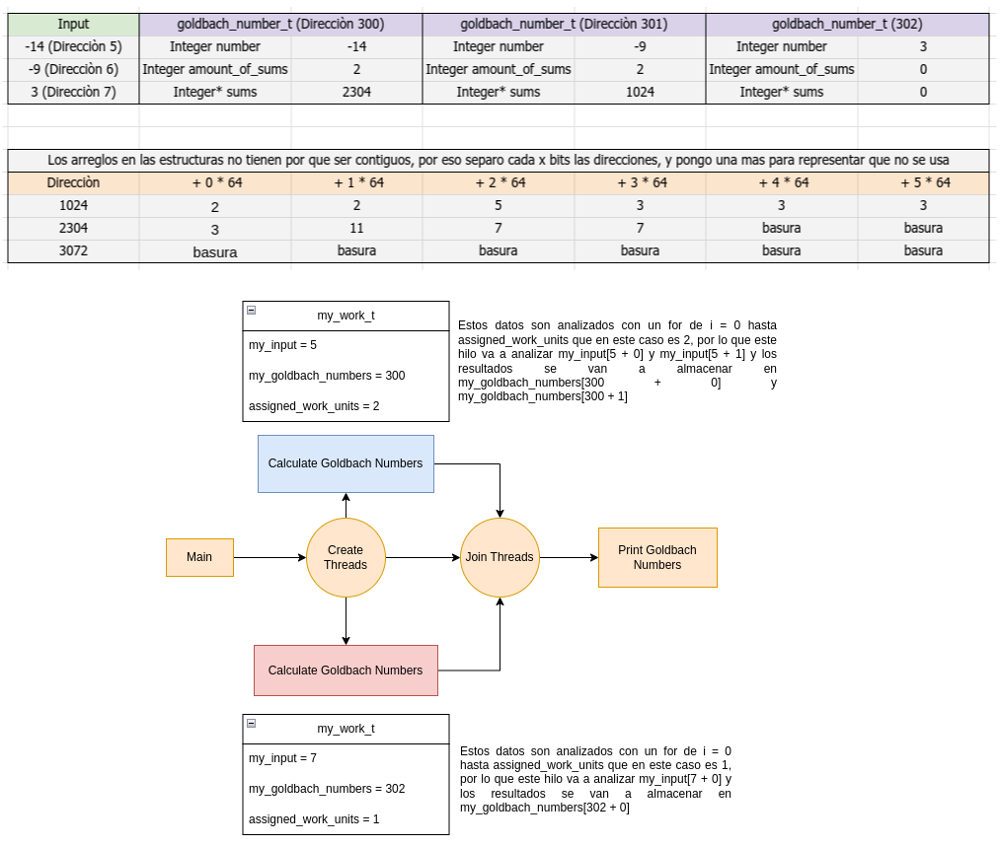

# Diseno de la estructura goldbach_number_t

## Input
Tanto 14 como 9 numeros negativos para demostrar como guardaria en memoria
El 3 va a representar un NA

## Estructra goldbach_number_t
number: numero a calcular sumas de goldbach
amount_of_sums: cantidad de sumas encontradas
sums: array que contiene las sumas

Con number y amount_of_sums basta para saber cuantos espacios tiene sums, 
ya que si es par se puede determinar con number, y cuantos espacios se determina
con amount_of_sums

## Estructra my_work_t
my_input: seccion del input que le corresponde a un hilo
my_goldbach_numbers: seccion de los goldbach_numbers que le corresponde a un
hilo y donde va a guardar el resultado
assigned_work_units: cantidad de numeros a analizar y guardar

Esta estructura le permite a cada hilo saber que parte de la memoria compartida
le corresponde, logrando asi la concurrencia de manera segura

## Pesudocodigo
[Pseudo: ./goldbach_pthread.pseudo](./goldbach_pthread.pseudo)
