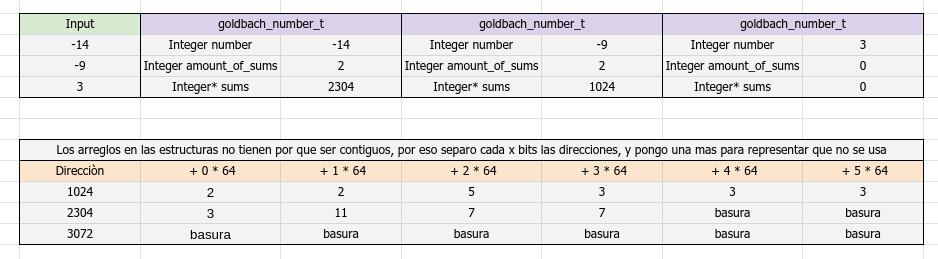

# Diseno de la estructura goldbach_number_t

## Input
Tanto 14 como 9 numeros negativos para demostrar como guardaria en memoria
El 3 va a representar un NA

## Estructra goldbach_number_t
number: numero a calcular sumas de goldbach
amount_of_sums: cantidad de sumas encontradas
sums: array que contiene las sumas

Con number y amount_of_sums basta para saber cuantos espacios tiene sums, 
ya que si es par se puede determinar con number, y cuantos espacios se determina
con amount_of_sums

## Pesudocodigo
(//goldbach_serial.pseudo)
